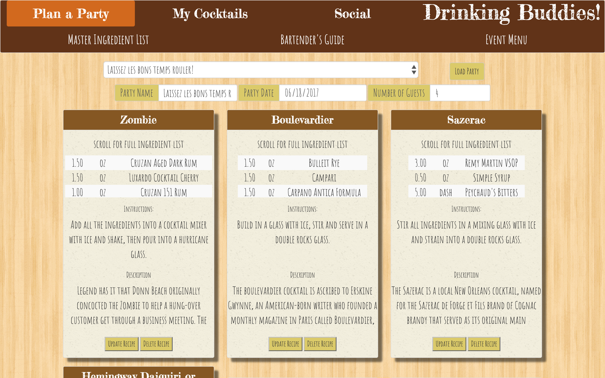

# Q2-Project: The Misterfits present: Drinking Buddies!!

## What is this application?
Drinking Buddies database (DBdb) is a full-stack web application layering a social-sharing component over a party-planning tool with access to a cocktail recipe database.

## What problem does DBdb solve?
Planning a get-together with friends should be an utterly enjoyable experience focused on the mixology craft and quality company. Too often, searching myriad sources for recipes, or recalling where they were stashed, or what whom should bring or when that party even was, keep us from concocting our libations and drinking life. By simplifying all aspects of cocktail party-planning, from recipe research and menu creation, to alerting friends and finding new connections, DBdb provides a refreshing entertaining solution.

## What technologies does DBdb use?
HTML5, Bootstrap CSS, ES6 & jQuery, Node & Express, PostgreSQL & Knex, Heroku

## Deployed Full-Stack application link (Heroku)
<https://drinking-buddies.herokuapp.com>

## Screenshots and Walkthrough
Upon first visiting [Drinking Buddies](https://drinking-buddies.herokuapp.com), users are greeted by a login page:

In order to proceed, users must register - to push the social agenda of connecting with others, as well as to restrict access to those of legal drinking age:

Upon successful login, token authentication is created to populate the users' various database authorizations, such as the Social tab, the secure-site's landing page, displaying core Profile information and current social connections:

From this page, users can find and connect with other registered users, querying the database with a username / full-name toggle. New friends are reloaded into the My Drinking Buddies area:

To manage interaction with the cocktail recipe database, users can inspect their collections of recipes known as 'menus' via the My Cocktails tab; the default page for this tab is My Menus providing an overview of created menus and the option to create a new menu:

Clicking `Create` initiates a new database table and redirects the user to the Recipes page in the My Cocktails tab...

Where recipes can be browsed (the default HTTP method on the page is GET all) - or searched by text...

And, added to any menu in the user's database table.

Confirming the addition (or the presence of that recipe on the menu already):

Accessing the suite of party-planning tools is accomplished via the Plan a Party family tab. Any menu may be loaded via the drop-down menu on the Plan a Party landing page - and attendee details checked:

The Master List provides an overview of the total ingredients required for the party, doing the algebra required to ensure adequate supplies are on-hand,

While the Bartender's Guide provides a simple abstract of the recipe,

And, the Party Menu details the libations for guests:

However, should the database fall short of supplying the specific cocktail a user desires, the user can create a new recipe by clicking the `Add New` button at the bottom of the page...

Which toggles open the create recipe dialog box:

Once the recipe is complete, `Update Recipe` adds the cocktail to storage...

And, adds it to the party menu:

## Minimum Viable Product goals
1. a RESTful server with routes for user authorization, and database CRUD
2. a 3NF database of cocktail recipes and users
3. a reasonably intelligible website to display the database
4. must-be-mobile

## Project Management tool (Trello)
<https://trello.com/b/w2uDPrnh/the-misterfits-present-drinking-buddies>

## Stretch goals
1. a more robust social component allowing:
  * responsibility sharing based on bar contents
  * searchable open party to engage local users outside one's immediate network
  * gamify user accomplishments - parties hosted, cocktails submitted, invites sent

2. eye-catching visualizations of cocktail recipes, both logged and in-process:
  * standard templates for ratios of liquor, liqueur, acid // sour, sweet, bitter

3. a tag system to categorize cocktail themes allowing:
  * narrowed recipe search
  * recipe suggestions
  * CSS-themes
